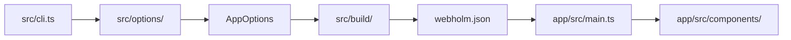
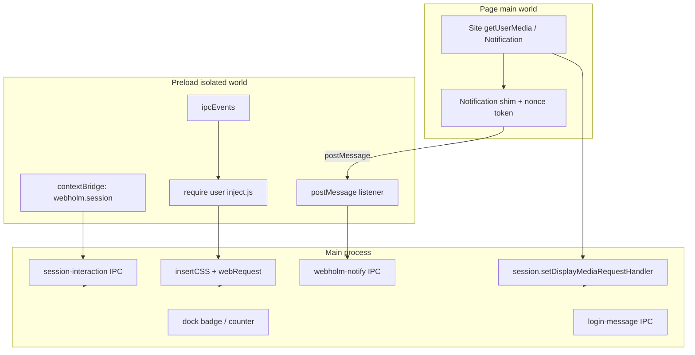

# Webholm Architecture

This document describes how the repository is split into layers and how configuration flows from the CLI into a packaged desktop app.

## Layers

| Layer | Path | Role |
| --- | --- | --- |
| **Shared contract** | `shared/src/` | TypeScript types and constants used by both build-time and runtime. No Electron, no filesystem packaging. |
| **Build-time** | `src/` | CLI (`cli.ts`), option normalization, inference, and the builder (`build/`). Runs on the developer machine when invoking `webholm`. |
| **Runtime template** | `app/src/` | Electron main process, preload, and UI helpers copied into every generated app. Runs inside the packaged app. |

Compiled output mirrors sources: `lib/` (CLI), `app/lib/` + `app/dist/` (runtime bundle), `shared/lib/` (types only, consumed via project references).

## Import rules

1. **`app/src/` must not import from `src/`** (builder/CLI). Runtime cannot depend on build-time code.
2. **`src/` must not import from `app/src/`** except by copying the app template directory at build time, not via TypeScript imports.
3. **Both layers import shared types through entry modules:**
   - Build-time: `src/buildTimeContract.ts`
   - Runtime: `app/src/runtimeContract.ts`
4. Direct imports from `shared/src/options/model.ts` are discouraged; prefer `buildTimeContract` or `runtimeContract` so boundaries stay obvious in code review.

ESLint enforces (1) and (2) with `no-restricted-imports` on all of `app/src/**/*.ts` and `src/**/*.ts` (including the contract entry files).

### Electron adapters (main process)

Main-process runtime must not value-import `electron` outside adapters. ESLint blocks `import … from 'electron'` in `app/src/**/*.ts` except:

- `app/src/adapters/**` (only place for value imports and Electron API calls)
- `app/src/preload.ts` and `app/src/preload/**` (separate preload context; optional strict mode in a follow-up PR)

Everywhere else (`main.ts`, `components/`, `helpers/`, `services/`, `config/`):

- Use adapter functions for Electron behavior.
- Use `import type` from `app/src/adapters/electronTypes.ts` when a type is needed.

Adapters in `app/src/adapters/`:

| Module | Role |
| --- | --- |
| `electronTypes.ts` | Type-only re-exports from `electron` |
| `appAdapter.ts` | `app` lifecycle, command line, user agent |
| `windowAdapter.ts` | `BrowserWindow`, `webContents`, zoom, navigation |
| `sessionAdapter.ts` | Session permissions, cache, proxy, IPC bridge |
| `contextMenuAdapter.ts` | `electron-context-menu` wrapper |
| `trayAdapter.ts` | Tray create/update |
| `menuAdapter.ts` | Application menu |
| `shellAdapter.ts` | `shell.openExternal` |
| `dialogAdapter.ts` | Message boxes |
| `clipboardAdapter.ts` | Clipboard read/write |
| `globalShortcutAdapter.ts` | Global shortcuts |
| `ipcAdapter.ts` | `ipcMain`, desktop capturer |
| `downloadAdapter.ts` | Download events |

Regression check: `rg "from 'electron'" app/src` should list only `adapters/` and `preload/` (not `*.test.ts`; tests use `jest.requireActual('electron')` or adapter mocks).

**Published npm package:** only `lib/` is shipped (see `.npmignore`). `buildTimeContract.ts` inlines `WEBHOLM_JSON_FILENAME` and `LEGACY_NATIVEFIER_JSON_FILENAME` and re-exports types only (erased at compile); it must not `require` `shared/lib` at runtime. Keep those constants in sync with `shared/src/contract.ts`.

## Configuration transport: `webholm.json`

The only supported channel from builder to packaged app is a JSON file next to the app resources:

- **Constant:** `WEBHOLM_JSON_FILENAME` in `shared/src/contract.ts` and `src/buildTimeContract.ts` (must match; CLI uses the latter in published builds). `LEGACY_NATIVEFIER_JSON_FILENAME` (`nativefier.json`) is still read for apps built before the rename.
- **Writer:** `mapAppOptionsToOutputOptions()` in `src/options/outputOptionsMapper.ts` (driven by `OUTPUT_FIELD_MAPPINGS`) writes `OutputOptions` during `prepareElectronApp()`.
- **Reader:** `app/src/config/loadRuntimeConfig.ts` loads and validates `webholm.json` at startup; components receive `OutputOptions` from `main.ts`.

Do not pass new settings across the boundary by importing builder modules into `app/src/`. Add fields to the shared option types, extend `OUTPUT_FIELD_MAPPINGS` (and `optionSchema.ts` for CLI), and read them from `webholm.json` in runtime.

## Where to change things

| Change | Start here |
| --- | --- |
| New CLI flag / default / validation | `src/options/optionSchema.ts` (metadata + mapping), `src/cli.ts` (positionals only), `shared/src/options/model.ts` (types) |
| New field in packaged app config | `shared/src/options/model.ts`, `OUTPUT_FIELD_MAPPINGS` in `outputOptionsMapper.ts`, runtime consumer in `app/src/` |
| Packaging / icons / Electron download | `src/build/` |
| Window, tray, menus, preload behavior | `app/src/` via `app/src/adapters/` (see Electron adapters above); preload stays under `app/src/preload/` |
| Runtime config load/validate/persist | `app/src/config/` |
| Cross-layer constant (e.g. config filename) | `shared/src/contract.ts` |

## Data flow (high level)

## Secure renderer (54.0.0+)

Main and child `BrowserWindow` instances default to `contextIsolation: true`, `nodeIntegration: false`, and `sandbox: true` (`sandbox: false` only when `flashPluginDir` is in runtime config). Secure defaults are applied in `getDefaultWindowOptions()` (`app/src/helpers/windowHelpers.ts`); `--browserwindow-options` → `webPreferences` merges **after** those defaults and can override them.

| Concern | Location | Notes |
| --- | --- | --- |
| Default `webPreferences` | `app/src/helpers/windowHelpers.ts` | `preload.js`, secure flags, Flash sandbox exception |
| User `--inject` | `app/src/preload/injectScripts.ts` | Preload world; use `webholm.session`, not `require('electron')` |
| Session bridge | `app/src/preload/webholmBridge.ts` | `contextBridge.exposeInMainWorld('webholm', …)`, plus the same bridge as legacy `'nativefier'` |
| HTTP login popup | `app/src/loginPreload.ts`, `app/src/static/login.js` | Separate window; `webholmLogin.submit` |
| Display capture | `app/src/services/displayMediaService.ts` | Main-process handler; picker HTML from `screenSharePicker.ts` |
| Notifications | `notificationShimSource.ts`, `notificationPostMessageBridge.ts`, `notificationTokenStore.ts`, `notificationIpcService.ts` | Nonce in inject closure; `postMessage` → preload → `webholm-notify`; main validates token and rate-limits badge |
| Renderer params / secrets | `app/src/config/runtimeSecrets.ts`, `persistRuntimeConfig.ts` | Whitelist IPC; strip sensitive keys on disk |
| Override escape hatch | CLI `browserwindow-options` → `OutputOptions.browserwindowOptions` | Merged last; see [API.md](../API.md#browserwindow-options) |

User-facing migration: [API.md](../API.md#secure-renderer-540). Breaking summary: [CHANGELOG.md](../CHANGELOG.md).

### Notification channel: known limitation

The per-navigation nonce limits spoofing from arbitrary page scripts, but it is **not** a cryptographic boundary. If the loaded site is fully compromised (XSS), attacker code in the page world can observe the token (closure / `postMessage`) and drive dock or tray badge updates within main-process rate limits. OS notifications still behave as before.

## Related docs

- [HACKING.md](../HACKING.md): setup, tests, contribution guidelines
- [docs/testing.md](testing.md): unit, contract, integration, and Playwright layers
- [docs/technical-roadmap.md](technical-roadmap.md): ESM, dependency, packager, and native-tooling decisions after stabilization
- [API.md](../API.md): user-facing CLI options
